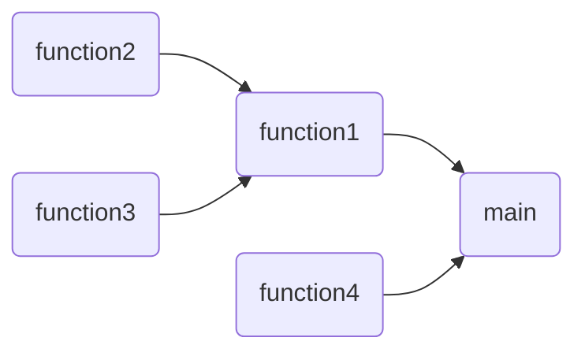

# Project Title

## Overview

Welcome to the CCTB's project template! This repository will guide newcomers at the CCTB towards a general structure for their own project. This will make it easy to follow for supervisors and successors alike.

## Table of Contents

1. [Introduction](#introduction)
2. [Dependencies](#dependencies)
3. [Project Structure](#project-structure)
4. [Getting Started](#getting-started)
5. [License](#license)

## Introduction

In general, you want to introduce the purpose of your project right here. Write anything you deem important, from the goals of the project to why you it is important. The purpose of this project is to showcase a simple yet structured project which aims to give inspiration to newcomers at the CCTB on how to structure their own projects. Code and Data examples are equipped with comments and metadata making it easy to get into for the next person working on a project.

## Dependencies

At this point you want to list all of the relevant dependencies you need for your project, such that anyone can easily build their own environment in the exact same way, e.g.

- **Python**: conda 23.7.4

If you are familiar with Python environments and used one specifically for your project you can easily provide all necessary packages using
````
pip freeze > requirements.txt
````
or if you are using Anaconda
````
conda list --export > requirements.txt
````
Put the `requirements.txt` file in you repo so anyone can easily install all of them using
````
pip install -r requirements.txt
````

## Project Structure

Our project is organized into the following directories:

- **Code**: Contains all Python/Julia/R/... scripts used in the project.
- **Data**: Includes raw input data required for the project, if their size is reasonable.
- **Results**: Contains images, processed data, and anything else related to results.
- **Manuscript (optional)**: Used for preparing theses or other forms of publications.

You can also try to visualize your source code in a dependency graph, to see which function depends on which.


## Getting Started

In this section, you want to get into more detail concerning the structure of your code and how to use it. If there is some `main` function or script, then explain how to use it properly to run your code. For this project itself, most codes are independent of each other so you can run them in any order you want.

- **`DataAnalysis.py`**: Processes the Data in `Data/ExampleData.csv` and saves the processed data under `Results/AnalysisData/` together with some metadata
- **`MandelbrotCode_Commented.py`**: Visualizes the Mandelbrot set. This is a version including docstrings (explanations for the functions), additional comments in the code and reasonable naming conventions for variables and functions, making it easy to follow 
- **`MandelbrotCode_Terrible.py`**: Visualizes the Mandelbrot set. This is a terrible example for coding. Bad naming conventions and no comments make it difficult to follow what this code is about.
- **`MandelbrotCode_Uncommented.py`**: Visualizes the Mandelbrot set. Same as the commented version. In some cases, good naming conventions are sufficient to understand the purpose of the code
- **`PlotData.py`**: Saves plots of processed data from `DataAnalysis.py` but also raw data in `Results/Figures/`

## License

This project is licensed under the MIT License - see the `LICENSE.md` file for details. Feel free to reach out if you have any questions or need assistance!
